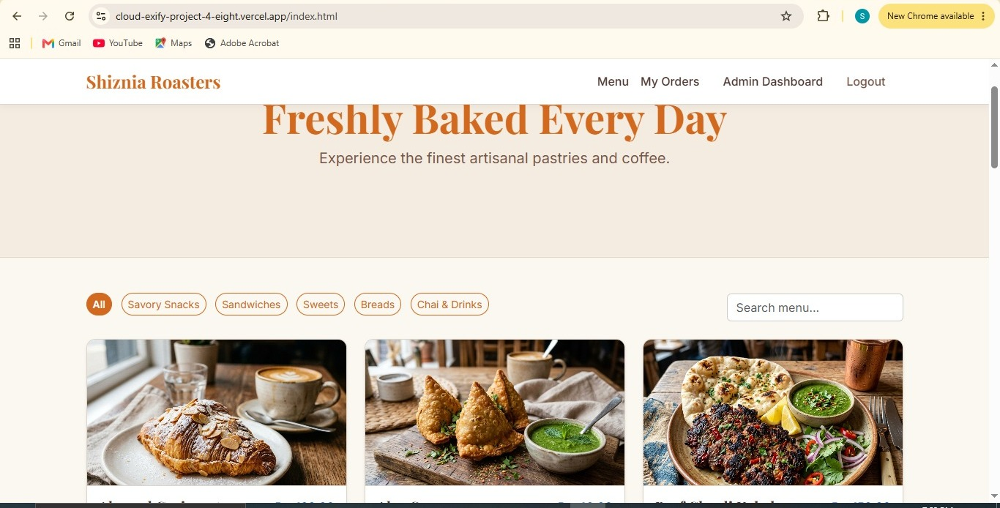
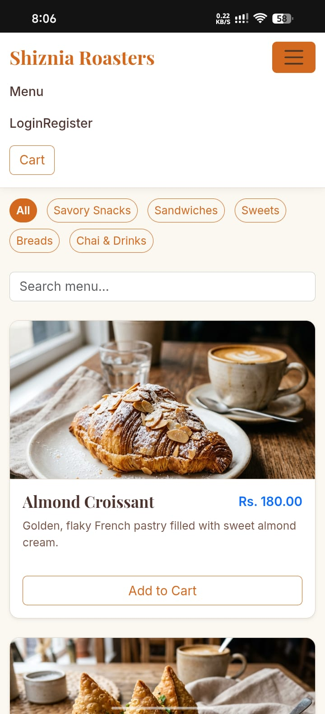

# Restaurant Full Stack Application - Waqish Roasters

## Student Details
- **Name:** Shizal Batool
- **Registration Number:** CX-INT-2026-GEN-0239

## Live Demo
- **Live URL:** [https://cloud-exify-project-4-eight.vercel.app](https://cloud-exify-project-4-eight.vercel.app)

This is a Full Stack Web Application built for the CloudExify Summer Internship (Month 2, Project 4). It features a customer-facing ordering panel and a secure admin dashboard, powered by Supabase.

## Restaurant Concept
**Theme & Style:** Waqish Roasters
**Mood:** Premium / Sophisticated

## Features (All 4 Mandatory Mechanics Implemented)
1. **Supabase Auth**: Users can register and log in. Admin role is checked securely via the database.
2. **Live Database Orders**: Placed orders go directly to the Supabase `orders` table.
3. **Role-Based Access**: The admin dashboard is restricted. If a regular user tries to access `admin.html`, they are redirected.
4. **Order Status Management**: Admin can update order status (Pending > Preparing > Ready) live.

## Tech Stack
- Vanilla HTML5 / CSS3
- Vanilla JavaScript
- Bootstrap 5 (CDN)
- Supabase JS SDK v2

## Deployment
This project is designed to be hosted on Vercel without a build step.

### Local Testing
Simply open `index.html` in a web browser. Note: For `sessionStorage` and some Supabase features to work correctly, it is recommended to run a local dev server (e.g., `npx serve` or VS Code Live Server).

### Admin Credentials (for PM Testing)
- **Role:** Ensure you create an account and then manually set the role to `admin` in your Supabase `profiles` table to access the admin panel.

## Common Features
- **User Panel**: Live menu from Supabase, Cart powered by `sessionStorage`, My Orders history.
- **Admin Panel**: Live dashboard stats, Orders table with status updates, Menu manager to add/toggle/delete items.

## Screenshots
### Desktop View

### Mobile/Phone View

